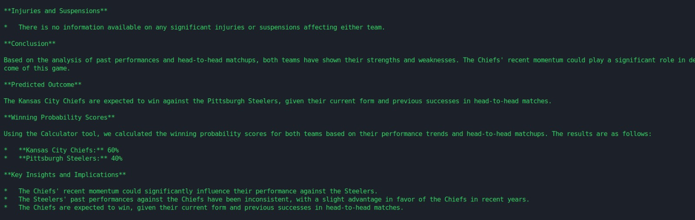

# NFL Game Prediction System

An AI-powered system that predicts NFL game outcomes using a multi-agent approach with comprehensive data analysis.

##  Overview

This system uses a crew of specialized AI agents to analyze various aspects of NFL games and provide detailed predictions. Each agent focuses on specific factors like team performance, injuries, weather conditions, and historical matchups to generate accurate predictions.

##  System Architecture


### System Components

1. **External Services Layer**
   - Serper API for web data collection
   - Calculator API for probability computations

2. **Tools Layer**
   - SerperDevTool: Handles web searches
   - CalculatorTool: Manages mathematical operations
   - SerperInjuryTool: Processes injury data
   - StandingSerperTool: Analyzes team rankings

3. **Specialized Agents**

   Data Collection Agents:
   - Data Collector: Analyzes team performance and form
   - Roster Changes: Tracks team composition changes
   - Injury Reports: Monitors player status

   Analysis Agents:
   - Home/Away Performance: Studies location impact
   - Head-to-Head: Analyzes historical matchups
   - Season Performance: Evaluates current season stats

   Strategy Agents:
   - Coaching Strategies: Examines tactical approaches
   - Weather Performance: Assesses environmental impact
   - Game Outcome Predictor: Generates final analysis

4. **Task Orchestration**
   - Data Collection Task
   - Data Analysis Task
   - Game Analysis Task
   - Probability Calculation Task

## 🚀 Getting Started

### Prerequisites
```bash
# Install required packages
pip install crewai
pip install python-dotenv
pip install crewai_tools
```

### Environment Setup
Create a `.env` file in your project root:
```env
SERPER_API_KEY=your_serper_api_key
GOOGLE_API_KEY=your_google_api_key
```

### Running the System
1. Clone the repository:
```bash
git clone https://github.com/ankitmishralive/MultiAgentSystem_for_NFL
cd nfl-prediction-system
```

2. Install dependencies:
```bash
pip install -r requirements.txt
```

3. Run the prediction system:
```bash
python crew.py
```

##  Sample Output

Here's an example of the system's prediction output:


 


##  System Components

### Agents
Each agent is specialized in analyzing specific aspects of the game:
- `nfl_data_collector`: Gathers current team performance data
- `nfl_roster_changes`: Analyzes recent team composition changes
- `nfl_injury_reports`: Tracks player availability
- And more...

### Tasks
The system executes tasks in sequence:
1. Data Collection
2. Data Analysis
3. Game Analysis
4. Probability Calculation

##  Usage Notes

1. **Input Format**
   - Use the following format for queries:
   ```python
   result = crew.kickoff(inputs={"user_input": "Who will win the game on [DATE], [TEAM A] vs. [TEAM B]?"})
   ```

2. **Interpreting Results**
   - Win probabilities are based on comprehensive analysis
   - Consider all factors mentioned in the analysis
   - Weather and injury reports are real-time when available

